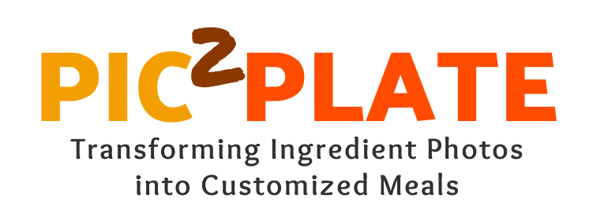

# Pic2Plate: AI-Powered Personalized Recipe Recommendations

---

**Pic2Plate** is a cutting-edge recipe recommendation framework that combines **Vision-Language Models (VLMs)** and **Retrieval-Augmented Generation (RAG)**. Designed to deliver highly personalized, context-aware recipes, Pic2Plate takes a user-centric approach to meal planning by seamlessly connecting ingredient recognition with advanced recipe retrieval techniques.

---

## 📖 **Table of Contents**
- [Features](#features)
- [How It Works](#how-it-works)
- [Performance Highlights](#performance-highlights)
- [Acknowledgments](#acknowledgments)
- [Future Work](#future-work)
- [License](#license)

---

## 🌟 **Features**
1. **Ingredient Recognition**:
   - Combines **FoodSAM** and Vision-Language Models for robust and context-aware ingredient identification.
   - Extracts structured ingredient lists from smartphone images or online inputs.

2. **Personalized Recipe Recommendations**:
   - Adapts to your dietary preferences, cooking styles, and available ingredients using **RAG** techniques.
   - Retrieves up-to-date recipes from online sources and customizes them using **LLMs**.

3. **Seamless User Experience**:
   - Works with simple image uploads and natural language inputs for preferences.

4. **State-of-the-Art Performance**:
   - Evaluated with real-world scenarios to ensure high accuracy, reliability, and user satisfaction.

---

## 🛠 **How It Works**
1. **Upload an Image**:
   - Take a photo of your ingredients using your smartphone or upload one from your device.

2. **Ingredient Recognition**:
   - **FoodSAM**, based on the **Segment Anything Model (SAM)**, segments the image into individual food items. FoodSAM’s fine-tuned capabilities ensure pixel-level precision, even for mixed or overlapping ingredients.
   - The **Vision-Language Model (e.g., GPT-4o)** complements FoodSAM by generating context-aware ingredient descriptions.

3. **Retrieve and Recommend**:
   - User preferences, combined with detected ingredients, guide the system to retrieve recipes.
   - **RAG mechanisms** enhance recipe accuracy and relevance by accessing an up-to-date recipe database.

4. **Personalization**:
   - The system refines recipes using **LLMs**, tailoring them to match your preferences.

---

## 📊 **Performance Highlights**
- **Ingredient Detection**:
  - **Precision**: 0.83
  - **Recall**: 0.91
  - **F1-Score**: 0.86

- **Human Feedback Rankings**:
  - **#1** in relevance, personalization, and usability across 120 participants.

---

## 🤝 **Acknowledgments**
We extend our gratitude to the developers of **FoodSAM**, whose work on the **Segment Anything Model** (SAM) serves as a cornerstone of our ingredient detection pipeline.  
Find the **FoodSAM paper** and its implementation here: [FoodSAM GitHub Repository](https://github.com/your-link).

---

## 💡 **Future Work**
- Broaden ingredient recognition capabilities for diverse cuisines and global food items.
- Introduce multi-language recipe suggestions for broader accessibility.
- Enhance customization for stricter dietary and allergy constraints.

---

## 📜 **License**
Pic2Plate is open-source and licensed under the MIT License. Contributions and feedback are always welcome!

---

✨ Empower your culinary creativity with **Pic2Plate**! Just snap, select, and savor. 🥗🍳
"""
